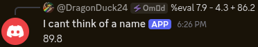
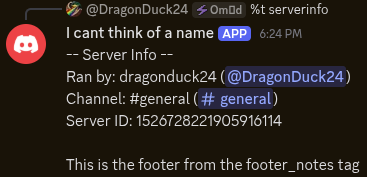
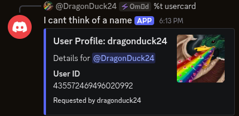

# Bunny Bot Scripting API Reference

This document provides a full reference for writing JavaScript script tags in **Bunny Bot**.

---

## Table of Contents

- [Data Structures and Objects](#data-structures-and-objects)
    - [User](#user)
    - [Message (`msg`)](#message-msg)
    - [Channel (`channel`)](#channel-channel)
    - [Guild (`guild`)](#guild-guild)
    - [Tag (`tag`)](#tag-tag)
    - [Embed Structure](#embed-structure)
- [Utility Functions (`util`)](#utility-functions-util)
    - [`util.fetchTag(name: string)`](#utilfetchtagname-string--tagobject--null)
    - [`util.execTag(name: string, args?: string)`](#utilexectagname-string-args-string--string--embedobject--null)
    - [`util.findUsers(query: string)`](#utilfindusersquery-string--user)
    - [`util.reply(content: string | Embed, embed?: Embed)`](#utilreplycontent-string--embed-embed-embed--string--embed)
- [Evaluation Context](#evaluation-context)
    - [Global Variables](#global-variables)
    - [JavaScript Tag Creation](#javascript-tag-creation)
- [Execution Limits & Rules](#execution-limits--rules)
- [Examples](#examples)

---

# Data Structures and Objects

All Snowflake IDs in script objects are returned as **strings** to preserve 64-bit integer precision.

### User

Represented on `msg.author` and elements returned by `util.findUsers`:

| Property   | Type             | Description                              |
|------------|------------------|------------------------------------------|
| `id`       | `string`         | User Snowflake ID                        |
| `username` | `string`         | Discord username                         |
| `avatar`   | `string \| null` | URL to user's avatar image, if available |

---

### Message (`msg`)

Globally available as `msg`:

| Property  | Type            | Description                            |
|-----------|-----------------|----------------------------------------|
| `id`      | `string`        | Snowflake ID of the triggering message |
| `content` | `string`        | Full raw message content               |
| `author`  | [`User`](#user) | User who sent the message              |

---

### Channel (`channel`)

Globally available as `channel`:

| Property | Type      | Description                                               |
|----------|-----------|-----------------------------------------------------------|
| `id`     | `string`  | Channel Snowflake ID                                      |
| `name`   | `string`  | Name of the channel                                       |
| `is_dm`  | `boolean` | `true` if channel is a Direct Message, `false` otherwise. |

Note: Bot currently only supports servers, so `is_dm` will always be true.

---

### Guild (`guild`)

Globally available as `guild`:

| Property   | Type     | Description                     |
|------------|----------|---------------------------------|
| `id`       | `string` | Guild (Server) Snowflake ID     |
| `name`     | `string` | Name of the guild               |
| `owner_id` | `string` | Snowflake ID of the guild owner |

---

### Tag (`tag`)

Available inside script tag executions:

| Property | Type             | Description                                                   |
|----------|------------------|---------------------------------------------------------------|
| `name`   | `string`         | Name of the currently executing tag                           |
| `args`   | `string \| null` | Arguments passed after the tag name in the command invocation |
| `body`   | `string`         | Raw JavaScript body / source code of the tag                  |
| `owner`  | `string`         | Snowflake ID of the user who created the tag                  |

---

### Embed Structure

Scripts can return embed objects directly. Any object matching embed fields will be parsed and rendered as a Discord
embed:

```ts
interface Embed {
    title?: string;
    description?: string;
    url?: string;
    color?: number; // Integer color code (e.g. 0x5865F2)
    author?: {
        name: string;
        url?: string;
        icon_url?: string;
    };
    fields?: Array<{
        name: string;
        value: string;
        inline?: boolean;
    }>;
    footer?: {
        text: string;
        icon_url?: string;
    };
    thumbnail?: {
        url: string;
    };
    image?: {
        url: string;
    };
}
```

---

# Utility Functions (`util`)

The `util` global object provides helper methods for interacting with tags, users, and responses.

### `util.fetchTag(name: string)` => `TagObject | null`

Fetches a tag by name from the current guild database without executing it.

**Return Value:**

```ts
{
    name: string;
    kind: "text" | "script" | "embed" | "alias";
    content: string; // Payload content or script body
    owner_id: string;
    payload: object;
    toString()
:
    string; // Returns 'content' when evaluated as a string
}
```

If the tag does not exist, returns `null`.

**Example:**

```js
const headerTag = util.fetchTag('header');
if (headerTag) {
    `${headerTag.content}\nWelcome!`;
}
```

---

### `util.execTag(name: string, args?: string)` => `string | EmbedObject | null`

Fetches and executes a tag in place.

- Executes `text`, `embed`, or `script` tags.
- If the target tag is a script tag, executes it with the provided `args` (or current `args` if omitted).
- Respects a maximum recursion depth limit of 5 levels to prevent infinite loops.

**Example:**

```js
// Executes 'welcome_card' passing 'Alice' as the tag argument
return util.execTag('welcome_card', 'Alice');
```

---

### `util.findUsers(query: string)` => `User[]`

Searches for up to 10 matching users in the guild by Snowflake ID, user mention (`<@123456789>`), or username / nickname
query.

**Example:**

```js
const matches = util.findUsers('dragonduck24');
if (matches.length > 0) {
    `Found user: ${matches[0].username} (${matches[0].id})`;
} else {
    "User not found!";
}
```

---

### `util.reply(content: string | Embed, embed?: Embed)` or `msg.reply(content: string | Embed, embed?: Embed)`

Explicitly sets the output response message or embed for the script execution.

- **Single-Use Limit**: Can only be called **once** per execution. Calling `reply` multiple times in a single script
  execution will throw an error (`reply can only be used once per execution`).
- **Priority**: Calling `reply` overrides the trailing return value / last evaluated expression of the script.

**Example:**

```js
util.reply("Welcome to the server!", {
    title: "Greeting",
    description: "Enjoy your stay!"
});

// Trailing expressions are ignored if reply() was explicitly called
```

---

# Evaluation Context

### Global Variables

Inside every script tag, the following globals are exposed:

- `msg`: The triggering [`Message`](#message-msg)
- `args`: `string` containing all arguments passed after the tag name
- `channel`: The [`Channel`](#channel-channel) context
- `guild`: The [`Guild`](#guild-guild) context
- `tag`: Current [`Tag`](#tag-tag) execution metadata
- `util`: The [`util`](#utility-functions-util) object

Standard JavaScript globals (`Object`, `Array`, `Math`, `JSON`, `Date`, `RegExp`, `Promise`, `parseInt`, `parseFloat`,
etc.) are available.

### JavaScript Tag Creation

Tags must be created with a code block to be evaluated as JavaScript:

````markdown
%t add <name> ```js
// Your JavaScript code here
const target = args.trim() || msg.author.username;
`Hello, ${target}!`;

```
````

The last evaluated expression in the script is returned as the tag output.

---

# Execution Limits & Rules

- **Execution Timeout**: 3 seconds max runtime per script.
- **Memory Limit**: 64 MB maximum memory heap size.
- **Stack Limit**: 1 MB stack size limit.
- **Recursion Limit**: Nested `util.execTag` calls are limited to 5 levels deep.
- **Silent Failure**: If the final evaluated value is `null`, `undefined`, or an empty string, the bot will not send a
  message.

---

# Examples

## Simple Eval



## Server Info

```js
// Fetch header tag object (accessing content directly via toString or .content)                                          
const header = util.fetchTag('header_banner');
const footer = util.fetchTag('footer_notes');

const channelName = channel.name ? `#${channel.name}` : 'DM';
const channelLink = `https://discord.com/channels/${guild.id}/${channel.id}`;
const invoker = msg.author.username;
const invokerMention = `<@${msg.author.id}>`;

`-- ${header ? header.content : 'Server Info'} --
Ran by: ${invoker} (${invokerMention})
Channel: ${channelName} (${channelLink})
Server ID: ${guild.id} 

${footer ? footer.content : ''}`;
```



(`header_banner` tag does not exist)

## User Card

```js
// Search for user from argument
const query = tag.args ? tag.args.trim() : msg.author.username;
const users = util.findUsers(query);

if (users.length === 0) {
    `No user found matching "${query}"!`;
} else {
    const target = users[0];

    // Returning an embed object directly
    ({
        title: `User Profile: ${target.username}`,
        description: `Details for <@${target.id}>`,
        color: 0x5865F2,
        fields: [
            {name: "User ID", value: String(target.id), inline: true}
        ],
        thumbnail: target.avatar ? {url: target.avatar} : undefined,
        footer: {text: `Requested by ${msg.author.username}`}
    });
}
```



